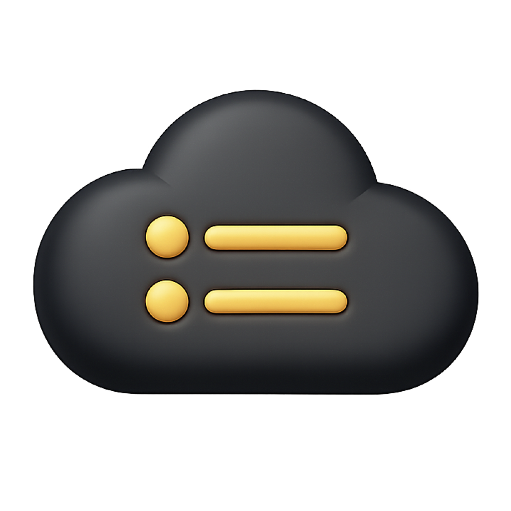

<p align="center">
  
</p>

# DNSDeck

A native SwiftUI DNS client for iPhone, iPad, and Mac. Manage accounts, zones,
and records across 24 providers, with credentials stored in Apple Keychain.

## Build your own copy

Use a Mac with Xcode 26 or newer and iOS platform support installed.
DNSDeck runs on iOS 18.0 or later and macOS 15.6 or later.

```sh
git clone https://github.com/avgeek-oss/dnsdeck.git
cd dnsdeck
make build-macos
make build-ios
```

These commands produce unsigned Release builds. All Swift dependencies are
included in the repository; no server or private package registry is needed.
The macOS app includes the local DNSDeckMCP companion.

For a signed build, copy `Config/Signing.local.xcconfig.example` to
`Config/Signing.local.xcconfig`, enter your team ID and a unique bundle
identifier, then open `DNSDeck.xcodeproj` in Xcode. Choose **DNSDeck macOS**
or **DNSDeck iOS** and run it. The local signing file is ignored by Git.

See the [build guide](docs/docs/build-from-source.mdx) for requirements,
signing, and output paths.

## Providers

Cloudflare, DigitalOcean, Hetzner, Akamai Cloud, Vultr, DNSimple, Gandi LiveDNS,
GoDaddy, Porkbun, Name.com, Namecheap, Spaceship, IONOS, Azure DNS, Oracle Cloud
DNS, deSEC, PowerDNS Authoritative, Scaleway, OVHcloud DNS, IBM NS1 Connect,
UltraDNS, Amazon Route 53, Vercel, and Google Cloud DNS.

Supported operations and credential requirements are defined in the
[provider catalogue](DNSDeck/ProviderDefinitions.json).
Read [how DNSDeck handles your data](docs/docs/privacy.mdx).

## Checks

```sh
make test             # Offline unit tests for all providers and shared packages
make build-ui-tests   # Compile the live-test target without running it
make format-check     # Requires SwiftFormat
```

See the [unit test guide](Tests/README.md).
Cloudflare is the only opt-in [live integration test](DNSDeckUITests/README.md).

## Documentation

The product homepage and Mintlify guides live in [docs/](docs/README.md).
Node.js 24 or newer is needed only for documentation tooling.

```sh
npm ci
npm run docs:dev      # Preview at http://localhost:4187
npm run docs:check
```

## Maintenance and license

DNSDeck is maintained by Avgeek. We publish the source so you can inspect how
the app works, clone it, and build or modify your own copy under the
[Apache-2.0 license](LICENSE). We do not accept external contributions or
pull requests. Feedback and bug reports are welcome through
[GitHub Issues](https://github.com/avgeek-oss/dnsdeck/issues).

Copyright 2026 Avgeek, Inc. DNSDeck and the bundled Avgeek Apple packages are
licensed under Apache-2.0. Provider names, trademarks, and artwork belong to
their respective owners; their inclusion does not imply endorsement or grant
rights to those marks.

The documentation uses [Avgeek OSS Docs](https://github.com/avgeek-oss/oss-docs),
copyright 2026 Avgeek, Inc., under Apache-2.0. Its homepage layout and header
behavior are derived from [Towbar](https://github.com/avgeek-oss/towbar), also
licensed under Apache-2.0.
